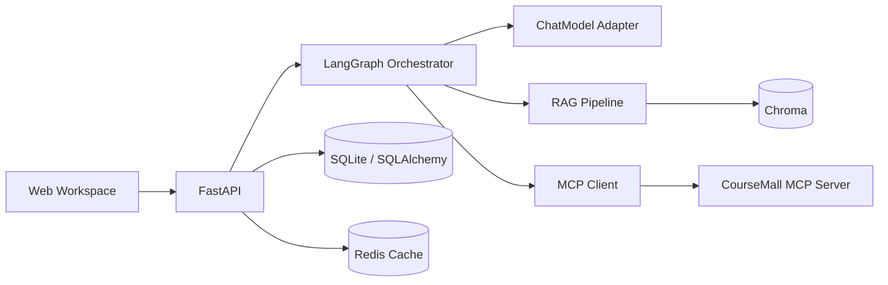

# Day 30 · CI、冒烟测试、项目验收与面试答辩

> **今天目标**：把项目从“我的电脑能跑”提升为“有说明、有自动检查、有部署验收、能完整讲清楚”。今天不再堆功能，而是建立可信交付闭环。

## 一、开发依赖（完整内容）

创建 `requirements-dev.txt`：

```text
-r requirements.txt
ruff==0.16.3
```

```powershell
python -m pip install -r requirements-dev.txt
```

## 二、替换项目工具配置（完整内容）

将 `pyproject.toml` 完整替换为：

```toml
[tool.pytest.ini_options]
pythonpath = ["."]
testpaths = ["tests"]
addopts = "-q"

[tool.ruff]
target-version = "py310"
line-length = 88
extend-exclude = ["migrations/versions"]

[tool.ruff.lint]
select = ["E", "F", "I", "B", "UP"]

[tool.ruff.format]
quote-style = "double"
indent-style = "space"
line-ending = "auto"
```

执行质量检查：

```powershell
ruff check app tests
ruff format --check app tests
python -m pytest
```

需要自动修复时先看 Git diff，再执行：

```powershell
ruff check --fix app tests
ruff format app tests
```

## 三、最终 `.gitignore`（完整内容）

将 `.gitignore` 完整替换为：

```text
# Python
__pycache__/
*.py[cod]
*.egg-info/
.venv/

# Test / lint / coverage
.pytest_cache/
.mypy_cache/
.ruff_cache/
.coverage
htmlcov/

# Local secrets
.env
.env.*
!.env.example
!.env.production.example

# Runtime data
data/
*.db
*.sqlite
*.sqlite3
logs/

# IDE / OS
.idea/
.vscode/
.DS_Store
Thumbs.db
```

## 四、部署冒烟测试（完整代码）

创建目录：

```powershell
New-Item -ItemType Directory -Force scripts
```

创建 `scripts/smoke_test.py`：

```python
import argparse
import json
import time
from typing import Any
from urllib.error import HTTPError, URLError
from urllib.request import Request, urlopen


def request_json(
    url: str,
    *,
    method: str = "GET",
    body: dict[str, Any] | None = None,
) -> dict[str, Any]:
    payload = None
    headers = {"Accept": "application/json"}
    if body is not None:
        payload = json.dumps(body, ensure_ascii=False).encode("utf-8")
        headers["Content-Type"] = "application/json"

    request = Request(url, data=payload, headers=headers, method=method)
    with urlopen(request, timeout=10) as response:
        return json.loads(response.read().decode("utf-8"))


def wait_until_healthy(base_url: str, attempts: int = 20) -> None:
    health_url = f"{base_url}/api/v1/health"
    for attempt in range(1, attempts + 1):
        try:
            request_json(health_url)
            print(f"[PASS] health check: {health_url}")
            return
        except (HTTPError, URLError, TimeoutError, json.JSONDecodeError):
            if attempt == attempts:
                raise RuntimeError("服务在等待时间内没有变为健康")
            time.sleep(1)


def run(base_url: str) -> None:
    base_url = base_url.rstrip("/")
    wait_until_healthy(base_url)

    question = {"question": "推荐 Python 课程"}
    endpoint = f"{base_url}/api/v1/cached-coach/ask"
    first = request_json(endpoint, method="POST", body=question)
    second = request_json(endpoint, method="POST", body=question)

    first_data = first["data"]
    second_data = second["data"]
    assert first_data["route"] == "catalog"
    assert first_data["courses"], "MCP 课程工具没有返回结果"
    assert second_data["cached"] is True, "第二次请求没有命中缓存"
    print("[PASS] integrated graph selected catalog route")
    print("[PASS] MCP course tool returned structured data")
    print("[PASS] second request hit answer cache")
    print("Smoke test completed successfully.")


def main() -> None:
    parser = argparse.ArgumentParser(description="QA Agent 部署冒烟测试")
    parser.add_argument(
        "--base-url",
        default="http://127.0.0.1:8000",
        help="已经启动的 QA Agent 地址",
    )
    args = parser.parse_args()
    run(args.base_url)


if __name__ == "__main__":
    main()
```

运行：

```powershell
python scripts/smoke_test.py
```

单元测试验证函数，集成测试验证模块协作，冒烟测试验证部署后的关键主链路。三者解决的问题不同，不能只留一种。

## 五、GitHub Actions CI（完整内容）

创建目录：

```powershell
New-Item -ItemType Directory -Force .github\workflows
```

创建 `.github/workflows/ci.yml`：

```yaml
name: QA Agent CI

on:
  push:
    branches: [main]
  pull_request:

permissions:
  contents: read

jobs:
  test:
    runs-on: ubuntu-latest
    timeout-minutes: 20
    env:
      APP_ENV: test
      DEBUG: "false"
      LLM_PROVIDER: fake
      CACHE_BACKEND: memory
      SQLALCHEMY_DATABASE_URL: sqlite+aiosqlite:///data/app.db

    steps:
      - name: Checkout repository
        uses: actions/checkout@v4

      - name: Set up Python
        uses: actions/setup-python@v5
        with:
          python-version: "3.10"
          cache: pip
          cache-dependency-path: |
            requirements.txt
            requirements-dev.txt

      - name: Install dependencies
        run: |
          python -m pip install --upgrade pip
          python -m pip install -r requirements-dev.txt

      - name: Lint
        run: ruff check app tests

      - name: Check formatting
        run: ruff format --check app tests

      - name: Apply database migrations
        run: |
          mkdir -p data
          alembic upgrade head

      - name: Run tests
        run: python -m pytest

      - name: Build Docker image
        run: docker build -t qa-agent:ci .
```

CI 使用 `fake` 模型，不把真实 API Key 放进 GitHub，也不会因第三方模型波动导致单元测试随机失败。真实模型链路应另设受控的定时评估任务。

## 六、最终 README（完整内容）

在你的 QA Agent 项目根目录创建或替换 `README.md`：

````markdown
# CourseMall QA Agent

面向 Java / Python 学习与 CourseMall 项目资料的智能问答系统。项目覆盖 FastAPI、LLM 适配、多轮记忆、RAG、混合检索、引用溯源、工具调用、LangGraph、MCP、多 Agent、缓存限流、异步 ORM、数据库迁移和容器部署。

## 核心能力

- OpenAI-compatible 模型适配，并提供零 Key 可运行的 Fake Model
- SSE 流式问答、多轮会话、摘要压缩和用户长期偏好
- 文档上传、切分、Embedding、Chroma 持久化、BM25 + 向量混合检索
- RRF 融合、Rerank、引用溯源、查询改写和离线回归评估
- 安全计算器、课程搜索、参数校验、超时、重试、并行工具执行
- LangGraph 条件路由、Checkpoint、人工确认、计划执行和多 Agent 协作
- MCP 2.x Server / Client，发布 Tool、Resource 和 Prompt
- SQLAlchemy 2.x 异步持久化、Repository、Alembic 迁移
- 内存 / Redis 双缓存、接口限流、Docker Compose、CI 和冒烟测试

## 架构



## 技术栈

| 层 | 技术 |
| --- | --- |
| API | Python 3.10、FastAPI、Pydantic v2、SSE |
| Agent | LangChain 1.x、LangGraph 1.x、MCP Python SDK 2.x |
| RAG | 自定义切分、Embedding、BM25、RRF、Chroma、Rerank |
| Data | SQLAlchemy 2.x Async、Alembic、SQLite、Redis |
| Quality | Pytest、Ruff、GitHub Actions、Smoke Test |
| Delivery | Docker、Docker Compose |

## 本地启动

```powershell
py -3.10 -m venv .venv
Set-ExecutionPolicy -Scope Process -ExecutionPolicy Bypass
.\.venv\Scripts\Activate.ps1
python -m pip install -r requirements-dev.txt
Copy-Item .env.example .env
New-Item -ItemType Directory -Force data
alembic upgrade head
python -m uvicorn app.main:app --reload
```

打开：

- 工作台：<http://127.0.0.1:8000>
- Swagger：<http://127.0.0.1:8000/docs>
- 健康检查：<http://127.0.0.1:8000/api/v1/health>

默认使用 Fake Model，不需要 API Key。接真实模型时修改 `.env`：

```dotenv
LLM_PROVIDER=openai-compatible
LLM_MODEL=你的模型名
LLM_BASE_URL=兼容接口地址
LLM_API_KEY=你的密钥
```

## Docker 启动

```powershell
docker compose -f compose.yml up --build -d
python scripts/smoke_test.py
```

## 主要接口

| Method | Path | 用途 |
| --- | --- | --- |
| GET | `/api/v1/health` | 健康检查 |
| POST | `/api/v1/qa/stream` | SSE 流式多轮问答 |
| POST | `/api/v1/documents/upload` | 上传知识文档 |
| POST | `/api/v1/rag/documents/{id}/index` | 文档切分和索引 |
| POST | `/api/v1/rag/ask` | 带引用的 RAG 问答 |
| POST | `/api/v1/agent/ask` | Function Calling 工具 Agent |
| POST | `/api/v1/approvals/start` | 启动人工确认工作流 |
| POST | `/api/v1/multi-agent/ask` | 多 Agent 协作 |
| POST | `/api/v1/coach/ask` | RAG + MCP + LangGraph 整合问答 |
| POST | `/api/v1/cached-coach/ask` | 带缓存和限流的整合问答 |
| GET | `/api/v1/conversations` | 持久化会话列表 |

完整 Schema 以 Swagger / OpenAPI 为准。

## 测试

```powershell
ruff check app tests
ruff format --check app tests
alembic upgrade head
python -m pytest
python scripts/smoke_test.py
```

测试分层：

- Unit：切分、融合、工具安全、缓存等纯逻辑
- Integration：RAG Pipeline、LangGraph、MCP Client/Server、Repository
- API：FastAPI 请求校验、异常协议、静态页面
- Smoke：部署后的健康、Agent、MCP、缓存主链路

## 安全边界

- 模型只提出工具调用，应用按白名单和 Pydantic Schema 校验后执行
- 计算器使用 AST 白名单，不使用 `eval`
- 文件限制类型、大小和随机存储名，避免路径穿越
- 高风险操作使用 LangGraph interrupt 人工批准
- 模型输出在网页中按文本渲染，避免直接 HTML 注入
- 密钥只从环境变量读取，不提交 Git
- Agent 设置最大轮数、超时、重试范围和限流

## 已知取舍

- Fake Embedding 和规则路由便于离线测试，不代表线上模型质量
- SQLite、内嵌 Chroma 和内存 Checkpoint 适合单实例学习与演示
- 横向扩容时应改用 PostgreSQL、共享向量服务、Redis Checkpoint/队列
- 当前引用校验只检查编号合法性，事实支持度仍需更强评估模型或人工抽检
- MCP 当前使用进程内 Client；跨服务部署时可切换 Streamable HTTP

## License

仅用于个人学习和作品集展示。
````

README 要写真实实现和真实限制，不要出现尚未完成的高并发数字、准确率或“企业级”等空泛表述。

## 七、面试答辩稿

### 1. 90 秒项目介绍

> 我做的是一个面向学习资料和 CourseMall 课程场景的 QA Agent。后端使用 FastAPI，模型层通过自定义 ChatModel 适配 OpenAI-compatible 接口，同时保留 Fake Model，使 CI 不依赖外部模型。知识问答走 RAG：文档上传后切分，使用向量和 BM25 双路召回，通过 RRF 融合、重排后生成带引用答案。需要实时数据时，LangGraph 会通过 MCP Client 调用课程工具；高风险动作则用 Checkpoint 和 interrupt 做人工确认。数据层使用 SQLAlchemy Async 与 Alembic，Redis 用于缓存和限流，最终通过 Docker Compose 部署，并有单元、集成、CI 和冒烟测试。

### 2. 最值得讲的三个难点

1. **可靠性**：检索为空时拒答，引用编号校验，RAG 评估集做回归，不把“接了向量库”当作完成。
2. **Agent 安全**：工具白名单、Pydantic 二次校验、安全 AST、超时重试、最大轮数、人工审批与幂等边界。
3. **工程解耦**：自有 ChatModel、MCP Gateway、Repository、Cache Protocol 让厂商、协议和存储可替换。

### 3. 高频追问与回答骨架

| 问题 | 回答骨架 |
| --- | --- |
| 为什么用 LangGraph？ | 流程有分支、循环、暂停和恢复；显式 State/Node/Edge 比嵌套 if 更可观测、可测试 |
| RAG 为什么会幻觉？ | 召回错、证据缺、模型误读或忽略约束；通过拒答、重排、引用和评估降低而非消灭 |
| Function Calling 是模型执行函数吗？ | 不是，模型只生成工具名和参数；服务端校验、授权、执行并返回观察结果 |
| MCP 与 REST 的区别？ | REST 是业务 HTTP 接口；MCP 面向 Agent 能力发现和调用，可封装 REST，但不替代核心业务 API |
| 为什么保留自有模型接口？ | 隔离模型厂商和 Agent 框架，便于 Fake 测试、降级、迁移和统一超时错误处理 |
| 怎么防 Agent 死循环？ | 最大轮数/步骤、超时、预算、重复调用检测、明确终止状态 |
| Redis 挂了怎么办？ | 缓存可 fail-open 回源；安全限流需按风险决定 fail-open/closed，并监控告警 |
| 为什么用 Alembic？ | ORM 只描述当前结构；迁移记录从旧版本到新版本的可审计变化 |
| 怎么扩容？ | 无状态 API，多实例共享 PostgreSQL/Redis/向量服务；Checkpoint 和文件存储也要外置 |
| 如何评价效果？ | 固定评估集跟踪 retrieval hit、MRR、引用、拒答、延迟和成本，改动前后做回归 |

## 八、不要编造指标，亲自记录

创建一张自己的验收记录：

| 指标 | Fake/本地基线 | 真实模型结果 | 测量方法 |
| --- | --- | --- | --- |
| 测试通过数 | 待填写 | 待填写 | `pytest` 输出 |
| RAG Hit@5 | 待填写 | 待填写 | Day16 评估集 |
| MRR | 待填写 | 待填写 | Day16 评估脚本 |
| P50/P95 延迟 | 待填写 | 待填写 | 固定问题重复请求 |
| 缓存命中延迟 | 待填写 | 待填写 | 首次与第二次对比 |
| 单次模型成本 | 0 | 待填写 | Token 用量 × 厂商单价 |

面试时只讲你亲自测量并能解释测试条件的数据。

## 九、最终验收命令

```powershell
# 本地质量门禁
ruff check app tests
ruff format --check app tests
alembic upgrade head
python -m pytest

# 容器交付门禁
docker compose -f compose.yml up --build -d
python scripts/smoke_test.py
docker compose -f compose.yml ps
```

再人工完成四条主链路：

1. 上传文档 → 索引 → RAG 提问 → 查看引用。
2. 推荐课程 → MCP 工具 → 查看结构化课程结果。
3. 高风险动作 → interrupt → 批准/拒绝恢复。
4. 同一问题请求两次 → 第二次命中 Redis 缓存。

::: tip 💡 面试题：一个项目“完成”的标准是什么？
不仅是功能能跑，还要有可复现环境、迁移、测试、错误边界、安全约束、可观测结果、部署验收和能诚实说明的技术取舍。
:::

## 十、知识点索引

| 知识点 | 一句话掌握 |
| --- | --- |
| CI | 每次提交自动执行统一质量门禁 |
| Lint / Format | 检查潜在错误并统一代码风格 |
| Smoke Test | 部署后快速验证最关键业务链路 |
| 质量门禁 | 不满足测试、格式或迁移条件就不交付 |
| 可复现性 | 新环境按文档能得到相同运行结果 |
| 技术取舍 | 说明为什么这样做、代价和下一步 |

## 十一、✅ 30 天毕业清单

- [ ] README 中的本地启动命令从零执行成功
- [ ] Ruff、Alembic、Pytest 全部通过
- [ ] Docker Compose 和冒烟测试通过
- [ ] 四条人工主链路通过
- [ ] 记录了真实评估与延迟数据
- [ ] 能脱稿完成 90 秒项目介绍
- [ ] 能回答上面的 10 个高频追问
- [ ] Git 中没有 `.env`、密钥、数据库和向量数据

完成时间：

最终测试数：

最满意的设计：

仍需改进的部分：

## 十二、项目完成后我会追问

1. 用 90 秒介绍项目，不按功能列表流水账。
2. 选一个你真正解决过的故障，按“现象—定位—根因—修复—预防”回答。
3. 如果日活增长 100 倍，最先出现的三个瓶颈是什么？
4. 如果模型供应商不可用，你的降级链路是什么？
5. 如果重新做一次，你会保留和改变哪些设计？
